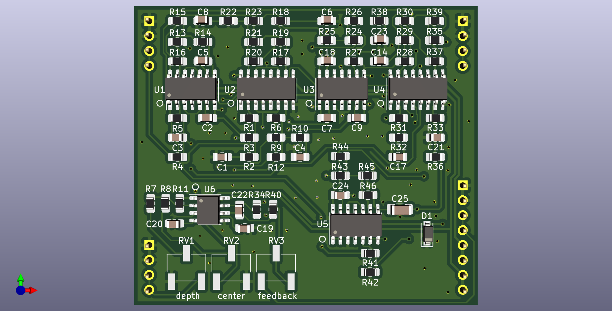

# NOTE: development of all VCF plug-in boards has been moved here https://github.com/JordanAceto/VCF_plug_in_boards
### This repo will no longer be updated. Follow the above link for the most current files.

# 2164 Phasor Plug-In Board

Small 6 stage SSM2164 based phase shifter PCB, designed to plug into a larger motherboard.

## Details

Six stage phase shifter implemented with SSM2164/V2164/SSI2164 quad VCAs. This PCB includes the audio path and CV inputs for frequency and feedback, but does not include any modulation sources.

The intended use for this board is to plug in to a larger motherboard which contains slots for two of these plug-in boards, as well as modulation sources, panel controls, and input/output routing. This motherboard could accept different filter boards sharing this footprint and header layout, for realizing stereo effects of various flavors.

## Inputs

-Audio in: dry audio input to be phase shifted.

-Frequency CV in: 0 volts to +2.048 volts, higher voltage = higher sweep.

-Feedback CV in: 0 volts to +2.048 volts, higher voltage = more feedback.

## Outputs

-Audio out: phase shifted audio output.

## Power Supply Requirements

A bipolar 12 volt power supply is needed. This will typically come from the motherboard.

## Calibration

-RV1 (depth trim): trims the depth of incoming frequency CV signals. Turn CW for greater depth and CCW for less depth. Adjust to taste.

-RV2 (center trim): trims the center frequency of the phase shifter. Turn CW for higher center frequency and CCW for lower center frequency. Adjust to taste.

-RV3 (feedback trim): trims the maximum amount of feedback. Turn CW for more maximum feedback and CCW for less maximum feedback. Exercise caution when adjusting this, as extreme settings can result in loud oscillations which could damage your ears or speakers if you are monitoring the sound with a loud amplifier. If you set this trimmer to be right on the edge of oscillation when about +2 volts is applied to the feedback CV input then make sure to sweep the frequency through its entire range, as a setting that doesn't squeal at certain frequency settings may squeal at other settings.

## Parts Ordering
The BOM has a link to a Mouser project with the majority of the parts needed to build the board, with the exception of the 2164 VCA chips. There is a link to the SmallBear Electronics parts page for these.

After the PCB is evaluated, the BOM will have a link to OSHPark, where you can order boards.

Zipped gerber files will be located in kicad_docs.

## License
CC by 4.0
